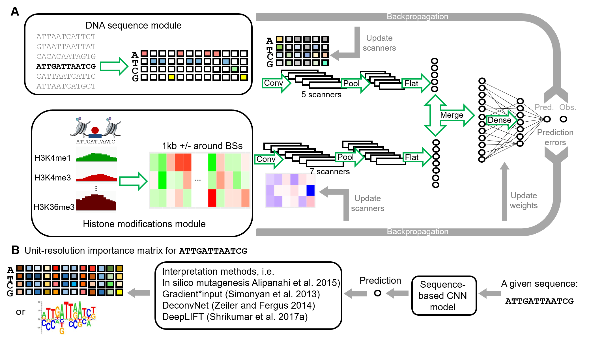

## multi-module CNN models

These scripts generate results in our manuscript entitled "Unraveling of transcription factor-DNA binding mechanisms through interpretable multi-module deep learning model". In this work, we built CNN models to study transcription factor (TF)-DNA binding both in vitro and in vivo. After well-performed models were trained, we interpreted binding mechanisms through network interpretation methods. The workflow is as follows: 

We systematically evaluated the strategies to handle DNA sequence orientations in sequence-based CNN models, they are CNN (RC model), CNN (canonical), CNN (canonical, RC augmented), and CNN (canonical, double sample) models. 

with four sequence-based CNN models and four network interpretation methods.
[insert a graph here]. Four network interpretation methods are .... Our goal of this work is to ... We also have case studies in eight Exd-Hox heterodimers, with SELEX-seq data deposited in ... 

## Dependencies

The pipeline requires:

* python 2.7
* DeepLIFT (citation) version at https://github.com/kundajelab/deeplift/tree/v0.6.6.2-alpha
* seq2logo
* Weblogo2

## Tutorial

## Project home page

For information on teh source tree, examples, isuses, and pull requests, see 

	https://github.com/xinbeibei/multi-module_CNN

